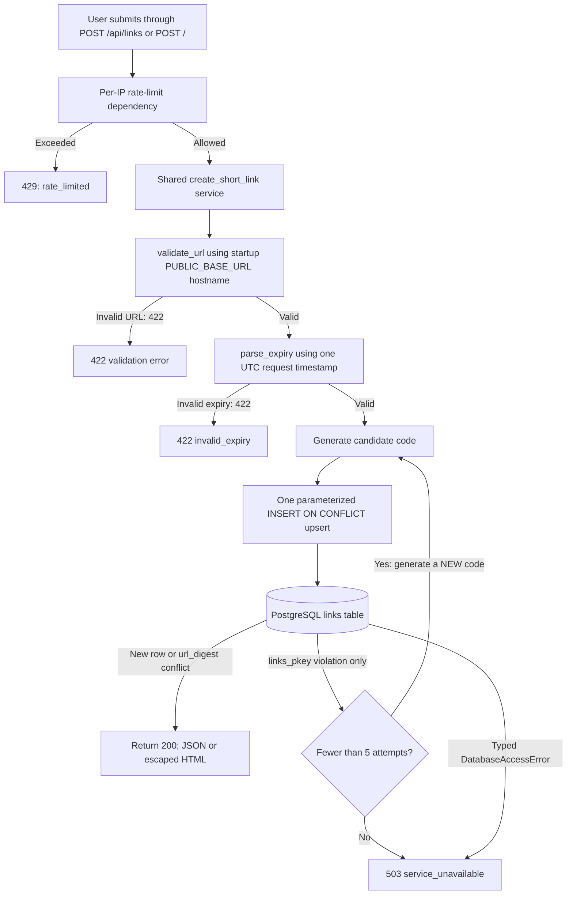
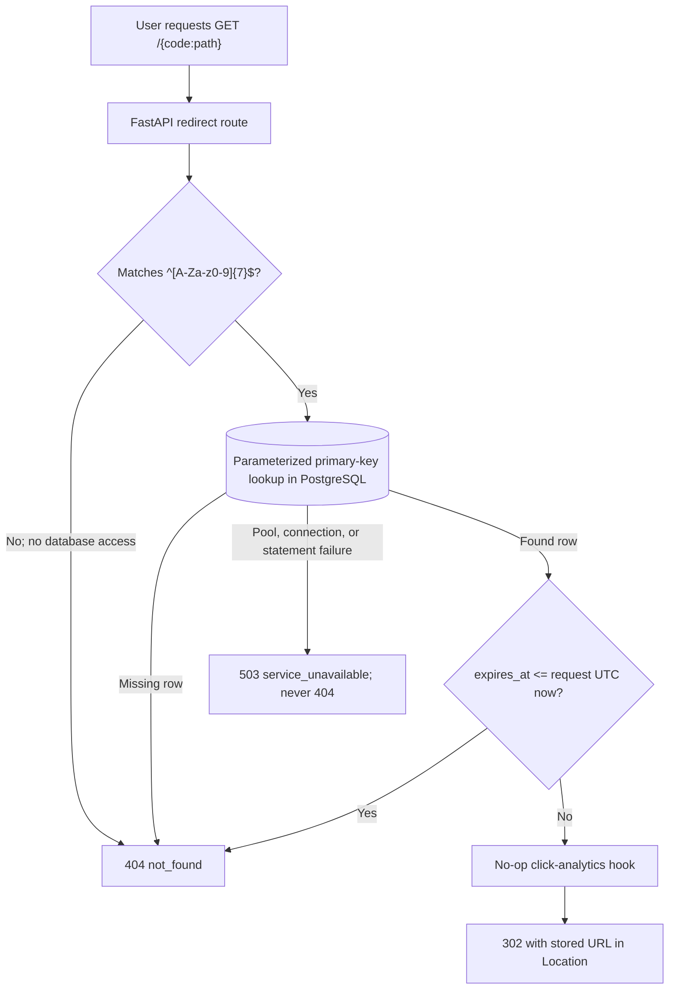

# Architecture Overview

This document describes the implementation as built. Requirement IDs are from [requirements.md](requirements.md); design decisions and remaining differences are listed separately.

## Components and Boundaries

- **FastAPI application:** `create_app()` builds the JSON API, HTML form, and redirect routes. The app lifespan loads settings, parses the public-base hostname once, opens the database pool, and closes it at shutdown. **[FR-2, FR-10, NFR-1, NFR-6]**
- **Form template:** `url_shortener/templates/index.html` renders GET `/`, form errors, and successful short URLs. Jinja is configured with autoescaping enabled. Every HTML response includes `X-Content-Type-Options: nosniff` and a Content-Security-Policy restricting sources, form submission, base URLs, and framing. **[FR-10]**
- **Validation and expiry:** `validation.py` validates exact submitted URL text, scheme, authority, destination host, and self-reference policy. `expiry.py` parses explicit-timezone RFC 3339 strings and enforces the future/365-day window. Both run before persistence. **[FR-3, FR-4, FR-5, FR-6, FR-7, FR-11]**
- **Create service and links module:** `app.create_short_link()` is shared by `POST /api/links` and `POST /`; `links.py` computes the exact-URL SHA-256 digest, performs the upsert, and provides indexed code lookup. **[FR-1, FR-11, FR-12, NFR-2, NFR-7, A-1, A-2, A-3]**
- **Settings and database:** `settings.py` reads connection, public-base, and pool/timeout values. `database.py` owns the synchronous psycopg pool (default min/max 1/10), 250 ms pool-acquisition wait, 2 s connection timeout, and 1 s statement timeout, and maps pool, operational, and statement-cancel errors to typed failures. Synchronous database calls from async routes use `run_in_threadpool`. **[NFR-2, NFR-3, NFR-4, NFR-6]**
- **Rate limiter:** an in-process sliding window uses the direct peer IP, allows 10 create attempts per 60 seconds, and periodically sweeps inactive entries. It is shared by JSON and form create routes; redirects do not use it. **[NFR-1, L-1, L-6]**
- **PostgreSQL:** the only external service and source of truth. The `links` table uses a seven-character Base62 primary key, a 32-byte SHA-256 digest, a unique digest index, and no expiry cleanup or cache. **[FR-1, FR-2, NFR-5, NFR-6, NFR-7, L-3]**
- **Docker Compose:** starts PostgreSQL only; the single-worker Python app runs separately. **[NFR-6]**

### Supporting Tools

- `scripts/check.py` and `.github/workflows/quality.yml` run quality gates and CI tests.
- `scripts/seed_links.py` bulk-loads a dedicated benchmark database.
- `scripts/load_test.py` runs HTTP load profiles and writes benchmark reports.

None of these tools is part of the running application service.

## Create Flow

The shared service validates the URL, parses expiry, persists, and constructs the short URL. Each attempt is one parameterized upsert. On a `links_pkey` collision only, it generates a new code; after five total attempts it returns 503. Database failures are not retried as collisions. **[FR-1, FR-3, FR-4, FR-5, FR-6, FR-7, FR-11, FR-12, NFR-2, NFR-7, A-1, A-2]**

## Redirect Flow

The analytics hook runs once only for a found, unexpired link. No cache is used. FastAPI’s documentation routes and fixed `GET /`, `POST /api/links`, and `POST /` routes are registered before the catch-all `GET /{code:path}` route. Unknown GET paths that reach it fail the code-format check and receive the standard JSON 404. **[FR-2, FR-8, FR-9, NFR-2, NFR-5, NFR-6, L-3]**

## Key Decisions

- **Exact URL identity and one upsert:** SHA-256 covers exact UTF-8 URL bytes; PostgreSQL's unique digest index arbitrates concurrent creates. There is no normalization, preliminary lookup, or advisory lock. **[FR-1, NFR-7, A-1]**
- **Expiry on repeats:** if either stored or requested expiry is NULL, the mapping becomes permanent; otherwise the requested expiry replaces it. **[FR-7, A-2, A-3, L-4]**
- **Code-collision scope:** only a unique violation naming `links_pkey` retries; the retry bound is five attempts. Other database failures become 503. **[FR-1, NFR-2]**
- **Host and URL text policy:** require ASCII authority and an ASCII hostname-label allowlist; reject backslashes and lone surrogate code points as well as malformed, whitespace, and control-containing URLs. Internationalized names must be provided as punycode. **[FR-3, FR-4, FR-5, FR-6]**
- **Sanitized failures:** fixed error messages and codes do not echo request values. JSON routes retain JSON responses; form submissions render escaped HTML errors at the corresponding status. **[NFR-1, NFR-2]**
- **Synchronous database access:** psycopg work from async endpoints runs in Starlette's thread pool to avoid blocking the event loop. **[NFR-3, NFR-4]**
- **No cache:** redirects always look up PostgreSQL; performance results are recorded rather than addressed with an unapproved cache. **[NFR-3]**
- **Alembic migrations (design decision; no requirement mentions a migration tool):** schema creation/evolution is explicit and repeatable; application startup does not migrate. This is a tooling decision, not an NFR-6 or NFR-7 requirement.

## Known Limitations

- **L-1:** the in-process limiter resets at restart and coordinates only one app process.
- **L-2:** DNS names are not resolved, so names resolving to private or loopback IPs may pass validation.
- **L-3:** expired rows are retained indefinitely.
- **L-4:** repeating an expiring URL without expiry makes it permanent.
- **L-5:** alternate numeric IPv4 forms are not normalized.
- **L-6:** behind a proxy, clients may share the proxy's direct-IP rate-limit bucket; forwarded headers are not trusted.

### Additional Known Gaps (Not in requirements.md)

- There is no request-body size limit.
- The serialized `expires_at` offset follows the database connection/session timezone; the app does not normalize the returned database value before JSON serialization.
- Limiter buckets have no hard cardinality cap; expired entries are removed during periodic sweeps.
- IPv6 clients can rotate source addresses within a `/64` and obtain separate limiter buckets.
- Numeric shorthand such as `127.1`, CGNAT addresses, and multicast ranges are accepted by the current parser/policy.
- Unicode internationalized hostnames must be submitted as ASCII punycode; Unicode authority text is rejected.

## Deviations from design.md (for review)

| Area | Built behavior differing from design.md | Evidence |
|---|---|---|
| Redirect route and unknown GET paths | Design names `GET /{code}`; code registers `GET /{code:path}`. Unmatched GET paths reach this route and return JSON 404 after code validation; fixed routes are registered first. | `url_shortener/app.py` |
| 422 error contract | The design gives an `invalid_url` example message. Code has `invalid_request` / `Request body is invalid.`, URL codes `url_too_long`, `invalid_url`, `credentials_not_allowed`, `self_reference`, `private_host`, and `invalid_expiry` with fixed messages. Malformed form parser input is rendered as 422 `Form data is invalid.` | `url_shortener/app.py`, `url_shortener/validation.py`, `url_shortener/expiry.py` |
| Other error codes/messages | Actual JSON codes are `not_found` / `Short link was not found.`, `rate_limited` / `Create rate limit exceeded. Try again later.`, and `service_unavailable` / `The service is temporarily unavailable.` HTML errors use fixed messages in the template. | `url_shortener/app.py`, `url_shortener/rate_limiter.py`, `url_shortener/templates/index.html` |
| Validation details | The implementation additionally rejects backslashes, non-ASCII authority text, lone surrogates, and hostnames outside an ASCII label allowlist; Unicode IDNs therefore require punycode. Numeric shorthand such as `127.1` passes through as a hostname, and CGNAT/multicast addresses are not rejected by the current `ipaddress` flag checks. | `url_shortener/validation.py` |
| Public base validation | Settings require an absolute public-base URL with a hostname and valid port, but do not restrict its scheme to HTTP(S). | `url_shortener/settings.py` |
| HTML response headers | HTML responses additionally set `X-Content-Type-Options: nosniff` and the stated Content-Security-Policy; these headers are not specified in design.md. | `url_shortener/app.py` |
| Startup database failure | The lifespan synchronously opens the pool before serving requests. If pool startup cannot connect, app startup fails rather than serving a request-time 503. Request-time typed database failures do map to sanitized 503 responses. | `url_shortener/app.py`, `url_shortener/database.py` |
| Database error handling boundary | Sanitized 503 handling is registered for typed `DatabaseAccessError` and code-generation exhaustion; arbitrary uncaught database exceptions have no broad handler and therefore are not normalized to the design's 503 response. | `url_shortener/app.py`, `url_shortener/database.py` |
| Retry-exhaustion logging | Design.md calls for a sanitized operational log after code retries exhaust. The handler returns the sanitized 503 but does not log an operational event. | `url_shortener/links.py`, `url_shortener/app.py` |
| Load measurement scope | The harness measures scheduled-to-response loopback HTTP latency, including generator/client scheduling; it is not an isolated server-side measurement. Its average redirect profile alone sets the NFR-3 verdict; peak and overload are report-only. | `scripts/load_test.py`, `README.md` |

### Contradictions with requirements.md

- **FR-6:** `127.1` is accepted as a hostname because it is not normalized by `ipaddress.ip_address`; clients commonly interpret it as loopback. This contradicts the requirement to reject loopback literals. CGNAT and multicast acceptance is an additional gap, but those ranges are not explicitly named by FR-6.
- **NFR-3 and NFR-4 measurement:** requirements call for server-side p99. The supplied harness measures loopback end-to-end p99, which includes client scheduling and loopback overhead and is an upper bound, not the server-only value. It should be interpreted as a conservative proxy rather than an identical measurement.
