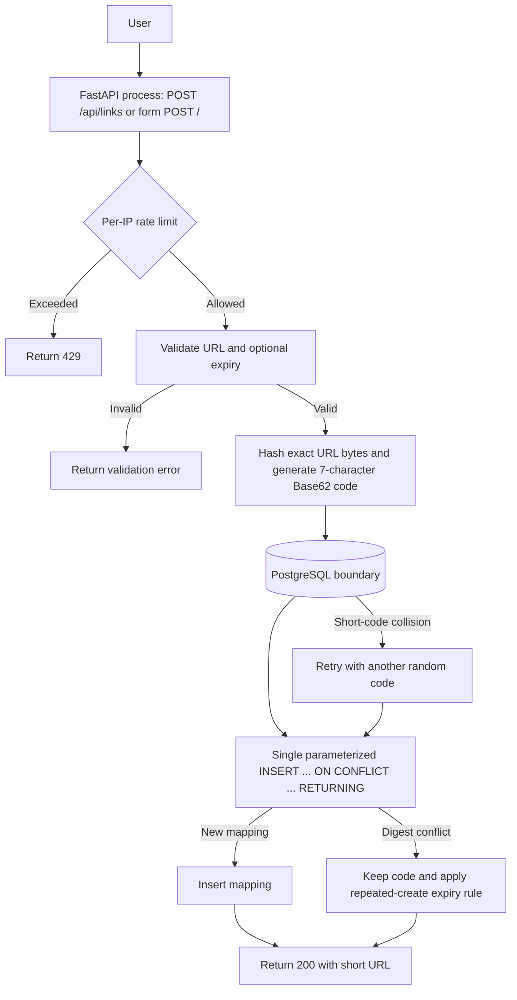

# Architecture Overview

This overview summarizes the approved prototype design in [design.md](design.md), with requirements traced to [requirements.md](requirements.md). It describes the planned architecture, not unimplemented runtime behavior.

## Components and Boundaries

- **FastAPI application process:** hosts the JSON create API and redirect route, validates requests, applies the create rate limit, and coordinates persistence. It runs as one local process. **[FR-2, FR-3, NFR-1]**
- **Jinja form:** renders the single-page create UI at `/`; template autoescaping protects displayed user-provided and generated values. It runs inside the FastAPI process. **[FR-10]**
- **In-process rate limiter:** keeps the per-direct-client-IP sliding-window timestamps in application memory and prunes old entries. It is not a separate service. **[NFR-1, L-1]**
- **PostgreSQL:** durable source of truth for URL mappings. Its primary-key index serves short-code lookups; its unique SHA-256 digest index arbitrates repeated creates. This is the application’s database boundary. **[FR-1, FR-2, NFR-5, NFR-7]**
- **One-service Docker Compose:** runs PostgreSQL only. The application is launched separately as a local Python process; Redis and a cache are not part of the initial design. **[NFR-3, NFR-6]**

## Create Flow



The digest unique index makes same-URL concurrent creates converge on one row. The short-code constraint handles independent code collisions. Both inserted and reused links return `200`. **[FR-1, FR-12, NFR-7, A-1, A-2, A-3]**

## Redirect Flow

```mermaid
flowchart TD
    U[User requests /{code}] --> A[FastAPI process]
    A --> C{Valid code format?}
    C -->|No| NF[Return 404]
    C -->|Yes| DB[(PostgreSQL boundary: lookup by code)]
    DB -->|No row| NF
    DB -->|Mapping found| X{Expiry set and at or before now?}
    X -->|Yes| NF
    X -->|No| H[Future click-analytics hook]
    H --> R[Return 302 with original URL in Location]
```

There is no cache initially, so redirects read PostgreSQL. The analytics hook is after successful lookup and expiry validation, immediately before the redirect response; analytics are out of scope for the initial build. **[FR-2, FR-8, FR-9, NFR-3]**

## Key Decisions

- **Unique URL digest and one upsert:** use a unique index on SHA-256 of the exact URL bytes and one `INSERT ... ON CONFLICT ... RETURNING` statement. The database arbitrates concurrent repeats; no advisory lock or separate URL comparison is used. **Reason:** preserve same-URL code identity with a small persistence flow. **[FR-1, NFR-7, A-1]**
- **No cache initially:** read redirects directly from PostgreSQL and benchmark before considering a cache. **Reason:** avoid another moving part until measurements show it is needed. **[NFR-3, NFR-6]**
- **HTTP 200 for both create outcomes:** return the same status and response shape for a new mapping and a reused mapping. **Reason:** `RETURNING` supplies the row without needing insert-versus-update detection. **[FR-12]**
- **In-process create limiter:** count requests by direct client IP in memory, without trusting proxy headers. **Reason:** meet the prototype limit without a separate rate-limit service. **[NFR-1, L-1, L-6]**
- **Alembic migrations:** initialize and evolve the schema through versioned migrations, run before app startup and integration tests. **Reason:** keep database structure explicit and repeatable with PostgreSQL as the only external service. **[NFR-6, NFR-7]**

## Known Limitations

- The in-process rate limiter resets on restart and only coordinates one application process. **[L-1]**
- DNS names that resolve to private or loopback addresses may bypass validation because hostnames are not resolved. **[L-2]**
- Expired mappings are retained indefinitely, so storage grows. **[L-3]**
- Resubmitting an expiring URL without an expiry makes it permanent under the repeated-create rule. **[L-4]**
- Alternate decimal, hexadecimal, and octal IPv4 spellings are not normalized and may bypass literal-IP classification. **[L-5]**
- Behind a proxy, requests may share the proxy IP’s rate-limit bucket because forwarded headers are not trusted. **[L-6]**
